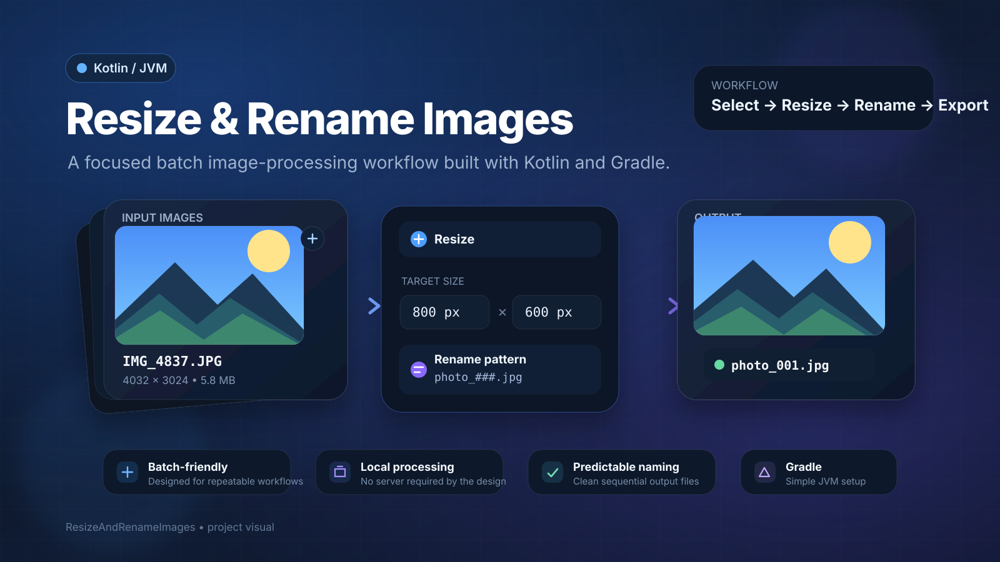

<div align="center">



# Resize & Rename Images

**A Kotlin/JVM utility project for building a simple, repeatable workflow to resize and rename image files.**

[](https://kotlinlang.org/)
[](https://openjdk.org/)
[](https://gradle.org/)
[](#current-status)

</div>

---

## Overview

**ResizeAndRenameImages** is a small Kotlin/JVM project intended to provide a local image-processing workflow for:

- resizing images to a target size,
- renaming files using a predictable naming pattern,
- processing multiple images in a repeatable way,
- keeping the workflow lightweight and local,
- running from a simple Gradle-based Kotlin project.

The project is intentionally minimal and can be expanded into a command-line image utility, desktop tool, or reusable image-processing module.

> **Important:** the repository currently contains the Kotlin/Gradle project foundation and a default `Main.kt` entry point. The actual image resize and rename logic has **not been implemented yet** in the current `master` branch.

---

## Current Status

The repository currently includes:

- Kotlin/JVM application setup
- Gradle wrapper
- Kotlin 1.9.10
- JVM target 1.8
- Gradle 7.6.1
- application entry point at `src/main/kotlin/Main.kt`
- the default console program generated for the project
- project artwork and documentation

The current entry point prints:

```text
Hello World!
Program arguments: ...
```

So this repository should currently be considered a **foundation / starter version** of the planned resize-and-rename utility.

---

## Intended Workflow

The project is designed around a straightforward local workflow:

```text
Input Images
     │
     ▼
Choose / scan source files
     │
     ▼
Resize to target dimensions
     │
     ▼
Apply naming pattern
     │
     ▼
Write processed images
     │
     ▼
Organized output files
```

A future implementation could support flows such as:

```text
IMG_4837.JPG
IMG_4838.JPG
IMG_4839.JPG
```

becoming:

```text
photo_001.jpg
photo_002.jpg
photo_003.jpg
```

while also resizing the images to a requested width and height.

---

## Project Goals

The main goals of this project are:

- **Simple usage** — avoid unnecessary complexity.
- **Batch processing** — make it easy to process many files together.
- **Predictable output** — use clean, sequential, or pattern-based names.
- **Local execution** — process files on the user's machine.
- **Small codebase** — keep the implementation easy to understand and maintain.
- **Extensibility** — leave room for CLI arguments, presets, format selection, and desktop UI support.

---

## Tech Stack

| Technology | Version / Usage |
|---|---|
| Kotlin | 1.9.10 |
| JVM | Target 1.8 |
| Gradle | 7.6.1 wrapper |
| Build DSL | Kotlin DSL |
| Application plugin | Gradle `application` |
| Main class | `MainKt` |
| Testing dependency | Kotlin Test |
| Test platform | JUnit Platform |

The project currently has no external image-processing library dependency.

---

## Project Structure

```text
ResizeAndRenameImages/
├── docs/
│   └── project-banner.svg
├── gradle/
│   └── wrapper/
│       └── gradle-wrapper.properties
├── src/
│   └── main/
│       └── kotlin/
│           └── Main.kt
├── build.gradle.kts
├── gradle.properties
├── gradlew
├── gradlew.bat
└── settings.gradle.kts
```

### Main files

**`src/main/kotlin/Main.kt`**  
Current application entry point.

**`build.gradle.kts`**  
Configures Kotlin/JVM, the application plugin, repositories, testing, JVM target, and `MainKt` as the main class.

**`settings.gradle.kts`**  
Defines the project name:

```kotlin
rootProject.name = "ResizeAndRenameImages"
```

**`gradle/wrapper/gradle-wrapper.properties`**  
Pins the project to Gradle 7.6.1.

---

## Requirements

To work with the project locally, you need:

- Git
- a Java Development Kit compatible with the configured JVM target
- no separate Gradle installation is required because the Gradle Wrapper is included

For development, IntelliJ IDEA is a natural fit because this is a Kotlin/JVM project.

---

## Clone the Project

```bash
git clone https://github.com/ahmadhashembatal77/ResizeAndRenameImages.git
cd ResizeAndRenameImages
```

---

## Run the Project

### Windows

```powershell
.\gradlew.bat run
```

### macOS / Linux

```bash
./gradlew run
```

The current version will print the default console output from `Main.kt`.

---

## Build the Project

### Windows

```powershell
.\gradlew.bat build
```

### macOS / Linux

```bash
./gradlew build
```

Build artifacts will be generated under the Gradle `build/` directory.

---

## Run Tests

The project includes Kotlin's test dependency and configures JUnit Platform.

### Windows

```powershell
.\gradlew.bat test
```

### macOS / Linux

```bash
./gradlew test
```

There are currently no project-specific tests in the repository.

---

## Planned Functional Design

A complete version of the utility can be separated into a few small responsibilities.

### 1. Input discovery

Find supported image files from:

- a single file,
- a selected folder,
- command-line paths,
- or recursively from a directory.

Possible supported formats:

- JPG / JPEG
- PNG
- BMP
- GIF for static-image handling where appropriate

Format support should be based on the actual image library selected during implementation.

### 2. Resize processing

Typical resize options could include:

- exact width and height,
- width-only with preserved aspect ratio,
- height-only with preserved aspect ratio,
- maximum bounding size,
- optional crop mode,
- optional no-upscale mode.

### 3. Rename processing

A naming engine could support patterns such as:

```text
photo_001.jpg
photo_002.jpg
photo_003.jpg
```

or:

```text
product_0001.png
product_0002.png
product_0003.png
```

Useful rename options could include:

- custom prefix,
- custom suffix,
- starting index,
- configurable zero-padding,
- preserving original extension,
- selecting a new output format.

### 4. Output handling

Processed images should ideally be written to a separate destination folder so source files remain safe by default.

A robust implementation should also define what happens when:

- a destination file already exists,
- an input file is invalid,
- an image cannot be decoded,
- the output directory is missing,
- processing only some files succeeds.

---

## Example Future CLI

The following is an **example design**, not functionality that exists in the repository today:

```bash
./gradlew run --args="--input ./images --output ./processed --width 800 --height 600 --prefix photo_"
```

A future direct executable or packaged application could expose a cleaner command such as:

```bash
resize-images \
  --input ./images \
  --output ./processed \
  --width 800 \
  --height 600 \
  --prefix photo_ \
  --start 1
```

Possible output:

```text
processed/
├── photo_001.jpg
├── photo_002.jpg
└── photo_003.jpg
```

---

## Suggested Internal Architecture

As the project grows, a clean structure could look like:

```text
src/main/kotlin/
├── Main.kt
├── cli/
│   └── Arguments.kt
├── image/
│   ├── ImageResizer.kt
│   └── ImageFormat.kt
├── rename/
│   └── FileNameGenerator.kt
├── processing/
│   └── BatchProcessor.kt
└── model/
    └── ProcessingOptions.kt
```

This would keep command parsing, image processing, naming logic, and orchestration separate.

---

## Recommended Implementation Order

1. Define processing options.
2. Accept an input file or folder.
3. Discover valid image files.
4. Add an image-processing implementation.
5. Resize while preserving image quality.
6. Add deterministic file naming.
7. Write results to an output directory.
8. Add collision handling.
9. Add useful console progress and error messages.
10. Add unit tests for rename and option logic.
11. Add integration tests for image processing.
12. Optionally package the project as a desktop application or CLI distribution.

---

## Potential Future Features

- batch folder processing
- recursive folder scanning
- drag-and-drop desktop UI
- resize presets
- aspect-ratio locking
- image compression / quality control
- JPG ↔ PNG conversion
- custom rename templates
- sequential numbering
- date-based names
- prefix and suffix support
- overwrite / skip / rename-on-conflict modes
- EXIF orientation handling
- metadata-preservation options
- before/after file-size reporting
- progress indicator
- dry-run mode
- processing summary
- parallel processing for large batches
- packaged native installers or distributions

---

## Safety Considerations for File Processing

When the resize/rename logic is implemented, it is best to make file handling conservative by default:

- do not overwrite source images unless explicitly requested,
- create the destination directory when necessary,
- validate decoded images before writing output,
- avoid silently replacing existing output files,
- report failed files clearly,
- preserve source files when one image fails,
- consider temporary files for safer writes.

---

## Known Limitations

In the current repository state:

- resize logic is not implemented,
- rename logic is not implemented,
- batch processing is not implemented,
- image format handling is not implemented,
- command-line options are not implemented,
- no image-processing dependency has been selected,
- no project-specific automated tests exist,
- there is no GUI.

These are documented explicitly so the README reflects the repository exactly as it exists today.

---

## Contributing

Contributions can follow a simple workflow:

1. Fork the repository.
2. Create a feature branch.
3. Make focused changes.
4. Test the changes locally.
5. Commit with a clear message.
6. Open a pull request.

Example:

```bash
git checkout -b feature/image-resizer
git add .
git commit -m "feat: implement image resize pipeline"
git push origin feature/image-resizer
```

---

## Author

Created by **Ahmad Hashem Batal**.

GitHub: [@ahmadhashembatal77](https://github.com/ahmadhashembatal77)

---

## Repository

[github.com/ahmadhashembatal77/ResizeAndRenameImages](https://github.com/ahmadhashembatal77/ResizeAndRenameImages)

---

<div align="center">

Built with **Kotlin**, **JVM**, and **Gradle**.

</div>
